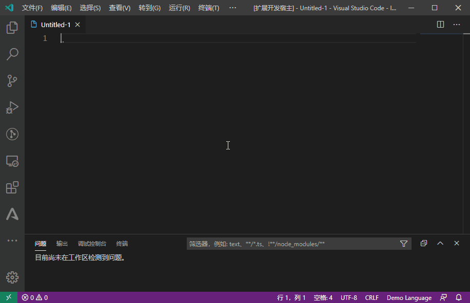

# LanguageServer.NET

[](https://www.nuget.org/packages/CXuesong.LanguageServer.VsCode) [](https://gitter.im/CXuesong/LanguageServer.NET?utm_source=badge&utm_medium=badge&utm_campaign=pr-badge)

A .NET implementation of [Language Server Protocol](https://github.com/Microsoft/language-server-protocol/blob/master/protocol.md) infrastructure library for VSCode, and hopefully, might also be used with other IDEs that support Language Server Protocol. It supports LSP 2.0 and should support LSP 3.x (if not, please open an issue; thanks).



Based on [CXuesong/JsonRpc.Standard](https://github.com/CXuesong/JsonRpc.Standard), this .NET Standard library intends to provide basic interfaces and data structures so that you can write a language server in C#, build it on .NET Core and, with the help of the client-side code of [Microsoft/vscode-languageserver-node](https://github.com/Microsoft/vscode-languageserver-node), use it in VSCode.

For an actual (WIP) [Wikitext](https://en.wikipedia.org/wiki/Wiki_markup) language server based on this library, please take a look at [CXuesong/MwLanguageServer](https://github.com/CXuesong/MwLanguageServer).

The library is now available on NuGet. To install the package, run the following command in the Package Manager Console

```powershell
Install-Package CXuesong.LanguageServer.VsCode -Pre
```

## To set up the demo

You may need Visual Studio 2017 to build the demo.

1.  Open `DemoLanguageServer` in VS, choose `Debug` profile, and build the project.
2.  Open `Client\VsCode` folder in VSCode.
3.  Run `npm install` in the terminal.
4.  Press F5 and a new VSCode window (Extension Development Host) should show.
5.  Open a folder in the new VSCode window, and create a new file.
6.  Change the file language to `Demo Language`
7.  Then your editor will work as shown in the screenshot. Enter `.net core` in the editor and see what happens.

To debug the server application, you may wish to turn `WAIT_FOR_DEBUGGER` conditional switch on in `DemoLanguageServer/Program.cs`. After starting up the Extension Development Host, and activating the language server, you may attach VS Debugger to `dotnet` process and go on debugging.

You may also set the `default` value of `demoLanguageServer.trace.server` to `"messages"` in `package.json` to make language client show more debugging information.